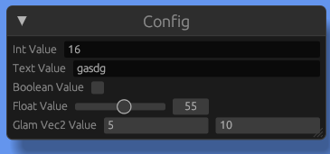

# EGUI Reflect

Experimental library to edit variables at runtime with egui.

# Example

```rs
use egui_reflect::EguiReflect;

#[derive(EguiReflect)]
pub struct Config {
    // Default (numeric) input:
    int_value: i32,

    // Text input
    text_value: String,

    // Toggle
    boolean_value: bool,

    // #[reflect(range)] turns it into a slider
    #[reflect(range = 0, 100)]
    float_value: f32,

    // Works for glam::Vec2 too if the `glam` feature is enabled
    #[reflect(range = 0, 1000)]
    glam_vec2_value: Vec2,
}

// in your egui rendering logic:
// let mut config: Config = ...

egui::Window::new("Config").show(ctx, |ui| {
    egui_reflect::reflect(ui, &mut config);
});
```

Will render:



Hobby project, use at own risk, etc etc

## License

Licensed under [BBHL](https://lifning.info/BBHL)
